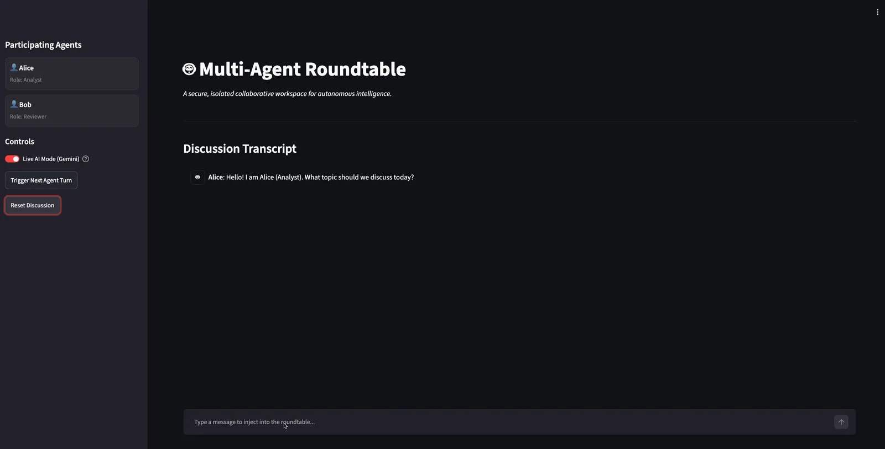
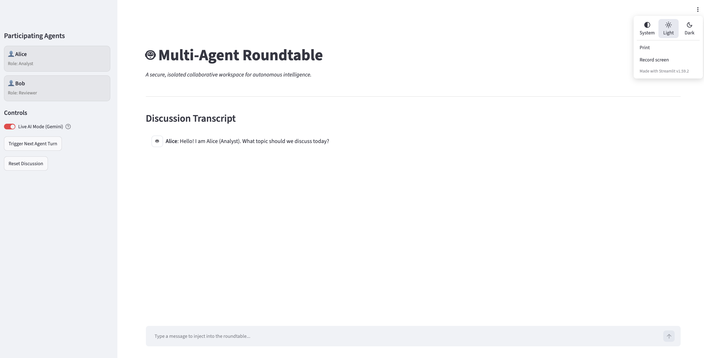
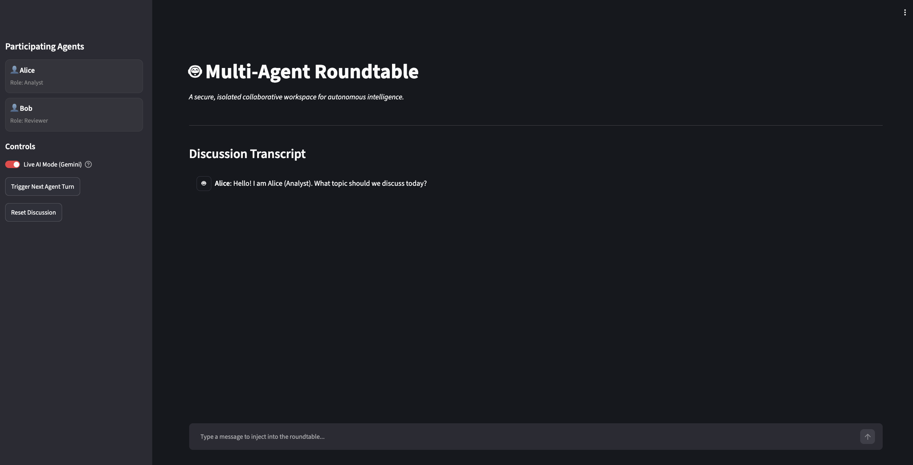
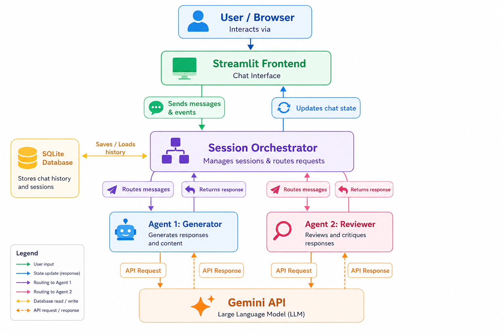

# Multi-Agent Roundtable

Welcome to the **Multi-Agent Roundtable**! This project demonstrates a collaborative environment where multiple AI agents interact with each other and with you, the user, to achieve complex tasks.

This project is built to showcase agentic workflows using Google's Gemini models in a live, interactive chat interface.

---

## 🚀 Getting Started (Step-by-Step)

Follow these simple steps to get the project running on your local machine.

### 1. Prerequisites
Before you begin, ensure you have the following installed:
- **Python 3.11+** or **Docker**
- A modern **Web Browser**
- A Google Gemini API Key (Get a free one at [Google AI Studio](https://aistudio.google.com/))

### 2. Execution

**Clone the repository:**
```bash
git clone https://github.com/zurasits/multi-agent-roundtable.git
cd multi-agent-roundtable
```

**Set up your environment:**
Create a `.env` file in the root directory and add your API keys. While only Gemini is required to start, Version 2 supports multiple LLM providers:
```env
# Required for Live Mode
GEMINI_API_KEY=your_gemini_key_here

# Optional: Add these if you want to switch agents to GPT or Claude
OPENAI_API_KEY=your_openai_key_here
ANTHROPIC_API_KEY=your_anthropic_key_here
```

**Run the application:**
You can run this project using either Docker or Python directly.

*Option A: Using Python (Recommended for quick start)*
```bash
# 1. Create a virtual environment
python3 -m venv venv

# 2. Activate the virtual environment
# On Mac/Linux:
source venv/bin/activate
# On Windows:
# venv\Scripts\activate

# 3. Install dependencies
pip install -r requirements.txt

# 4. Run the Streamlit app
streamlit run src/frontend/app.py
```

*Option B: Using Docker*
```bash
docker-compose up --build
```

**Open the Interface:**
Open your web browser and navigate to the following URL:
👉 **[http://localhost:8501](http://localhost:8501)**

### 3. Expected Result
When you open the URL, you will see a clean, glassmorphic chat interface featuring:
- **2 Distinct AI Agents** ready to collaborate.
- 🧠 **Individual LLM Selection:** A sleek dropdown in each agent's card to switch their brain (Gemini, GPT, or Claude) on the fly!
- A **Live Mode** connection to the AI models.
- A **"Trigger next agent"** button on the sidebar.
- A **"Reset Session"** button on the sidebar to clear the conversation.

---

## ✨ What's new in Version 2

Version 2 introduces powerful flexibility and a stunning UI overhaul:
- **Multi-LLM Support:** Agents are no longer tied to just Gemini. Mix and match OpenAI's GPT, Anthropic's Claude, and Google's Gemini within the same roundtable discussion.
- **Sleek UI:** Completely redesigned agent cards with native, dark-mode integrated provider selection.
- **Dynamic Fallbacks:** The system automatically checks your `.env` variables and falls back to Gemini if a selected provider's API key is missing.

---

## 🔄 Workflow: How to use it

To get the most out of this roundtable, follow this clear workflow:

1. **Ask a Question:** Start the conversation by typing a prompt or question into the chat box.
2. **React to the Answer:** Once the first agent replies, you have two choices:
   - **Ask a follow-up question** to clarify or iterate on their response.
   - 🎯 **CRITICAL STEP:** Click the **"Trigger next agent"** button in the sidebar. This passes the baton to the second agent, allowing them to review, expand, or critique the first agent's work. **This handoff is the core goal of the project.**
3. **Interject Anytime:** You are part of the roundtable! You can jump into the conversation at any time. If you want to address a specific agent, simply use **`@AgentName`** in your message (e.g., `@Reviewer what do you think about this?`).

---

## ⚠️ Limitations (Version 1)

Please note the following limitation in the current version:

- **Explicit Mentions Required:** The agents currently *only* respond when explicitly triggered via the "Trigger next agent" button or when explicitly mentioned using the `@` symbol in the chat.
- **Coming in Version 2:** Semantic context understanding—where agents will naturally understand the flow of conversation and jump in automatically without needing an `@` mention—is planned for the next major update.

---

## 📸 Screenshots & Demo

### Live Workflow Demo


### Adaptive UI Themes
**Light Mode**  


**Dark Mode**  


---

## 🏗️ Architecture

Below is a high-level overview of how the Multi-Agent Roundtable operates:


